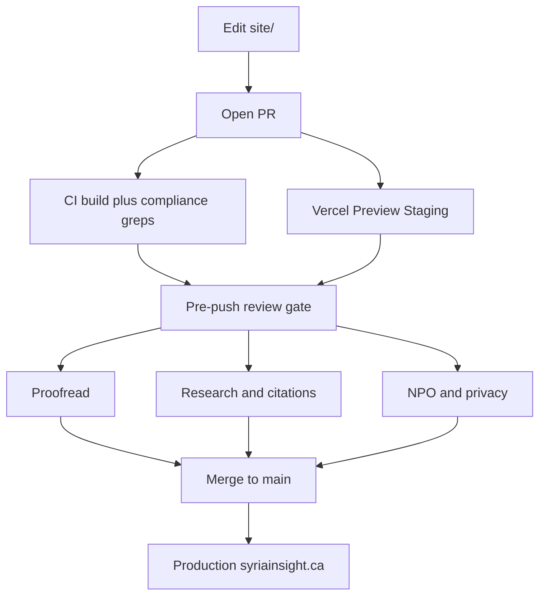

# Pre-push review gate

**Required** before every push or merge to `main` (production → [syriainsight.ca](https://syriainsight.ca)).

CI runs automated smoke checks (see [`.github/workflows/build.yml`](../.github/workflows/build.yml)). This gate is the **human** portion: proofreading, research citations, and Canadian not-for-profit / privacy posture.

Paste into the PR description when complete:

```text
Pre-push gate: done
```



---

## 1. Proofreader

- [ ] Spelling and clarity in Canadian English (`lang="en-CA"` where set)
- [ ] Dates consistent (ISO in `<time datetime>` + readable “19 July 2026” style)
- [ ] No developer-only or roadmap notes in public UI (examples: “Replace YOUR_FORM_ID”, “next sprint”, “TODO”, “later sprints”)
- [ ] Sitewide disclaimer bar present: **Not legal advice**
- [ ] “Last reviewed” / snapshot dates bumped on pages whose content changed
- [ ] Mobile check on Preview URL (nav, forms, tables)
- [ ] 404 page still works for unknown paths
- [ ] **Global footer sync:** every public page footer Trust column includes Changelog (`/changelog.html`); Explore tool link says **Screening assistant** (not “Decision assistant”)
- [ ] Footer NPO line is definitive: independent research initiative / **not currently a CRA-registered charity** — no conditional “unless a registration number is published” template wording
- [ ] User-facing tool name is **Screening assistant** (form element IDs may still use `decisionForm` / `decisionResult`)

## 2. Researcher (citations & Canadian source discipline)

- [ ] Every material legal or KPI claim links to a **primary** Government of Canada source (GAC, Justice Laws, Canada Gazette / Canada.ca announcement)
- [ ] Operational analysis (for example “bankability”, cross-jurisdiction friction) is labelled as analysis, not statute
- [ ] List counts state **as-of announcement date**; do not invent live totals
- [ ] New sources added to [`site/references.html`](../site/references.html)
- [ ] If `sanctions.html` or `figures.html` changed: run [`MONITORING_CHECKLIST.md`](MONITORING_CHECKLIST.md)
- [ ] **Screening assistant** still rule-based; no generative “you may proceed” as legal clearance
- [ ] If LLM/RAG is ever used to draft legal or list content: outputs must be grounded to cited primary text, human-gated before production, and must not invent list entries (no ungrounded generation)
- [ ] **Foreign-law / OFAC notice:** [`site/sanctions.html`](../site/sanctions.html) and [`site/faq.html`](../site/faq.html) include an explicit cross-jurisdiction callout (US OFAC / EU / UK + bank policy independence). Operational and banking briefs should state or link the same point — Canadian SEMA compliance does not neutralize foreign regimes
- [ ] **Sector pages** (`site/sectors/*.html`): Canada / GAC block first; Investor Guide material is short paraphrase + attribution only — see [`SOURCE_LICENSING.md`](SOURCE_LICENSING.md). Do **not** host or link to local guide PDFs on the public site; embassy business URL may be linked as a target.
- [ ] Hub [`site/sectors.html`](../site/sectors.html) links remain valid for banking, energy, telecom, real-estate
- [ ] When public copy or sources change: append an entry to [`CONTENT_CHANGELOG.md`](CONTENT_CHANGELOG.md) (newest first) and mirror it on [`site/changelog.html`](../site/changelog.html); bump “last reviewed” on touched pages

## 3. NPO / privacy (Canadian public-interest posture)

- [ ] About still states: **independent research initiative**; **not currently a CRA-registered charity** (no CRA number published → no charity claim; do not invent federal NFP / CRA registration)
- [ ] Footer NPO line matches About (definitive, not conditional template)
- [ ] No donation solicitation or tax-receipt promises
- [ ] Support framed as **informational triage**, not a legal clinic or guaranteed service
- [ ] Privacy still covers PIPEDA fair-information practices and OPC links
- [ ] Privacy discloses Formspree / Vercel (or current processors) and that processing may occur **outside Canada**
- [ ] Screening assistant is client-side only: each submit replaces the result DOM; no cross-query session store of prior scenarios in `localStorage` / `sessionStorage`
- [ ] Footer trust language intact (methodology, privacy, references, changelog)
- [ ] Contact / privacy inbox (`hello@syriainsight.ca`) still accurate

---

## Gate rule

**Do not merge to `main` until sections 1–3 are checked and CI is green.**

Staging Preview alone is not enough for sanctions, figures, disclaimer, privacy, or About status text.

## After merge

1. Confirm production: https://syriainsight.ca  
2. Spot-check Home KPIs, Sanctions sources, Privacy, About status  
3. If DNS/SSL pending, also confirm https://canada-syria-access.vercel.app  
